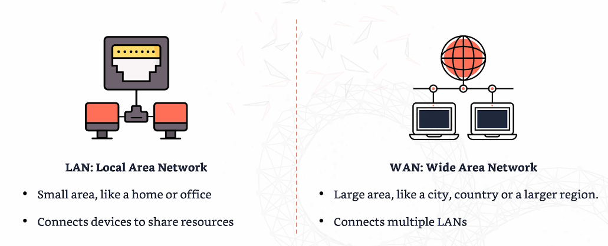
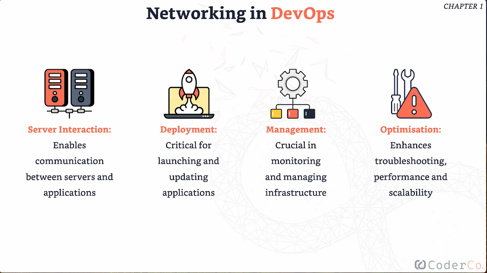

<h1 align="center"><em>Networking</em></h1>

# Table of Contents

- [Introduction to computer networks](#introduction-to-computer-networks)
- [Key Networking Components ](#key-networking-components)
- [OSI 7-Layer Model](#osi-7-layer-model)

## Introduction to computer networks

- A **computer network** is a group of **devices** connected together, allowing the sharing of information and **resources**.

- There are two core types:
  - **Local Area Network (LAN)**: Small and covers a limited area.
  - **Wide Area Network (WAN)**: Similar to the internet, connecting schools and **businesses** worldwide.

    

- Networks are the foundation that allows communication between devices, enabling us to use the internet to watch movies, communicate, and browse the web.

- They allow us to share resources, such as printers or shared files at work.

- They support apps for **connectivity** and data transfer.

- Netowrking in DevOps
  
  </img>
  

## Key Networking Components 

- ***Switches***
   - Connect **multiple** devices within the same network.
   - Manage data flow within a **LAN**.
   - Prevent congestion and ensure efficient communication.

- ***Routers*** 
   - Direct traffic between different networks.
   - Ensure data gets to the right place.
   - Connect different networks, such as your home network to the internet.

- ***Firewalls***
   - Protect networks.
   - Monitor and control incoming and outgoing network traffic.

### OSI 7-Layer Model

The OSI model is a conceptual framework used to understand and implement standard networking protocols. Although not all networking software follows this exact model, it provides a strong foundation for networking principles.

<h4 align="center"><em>7 Layers Stacked on Top of Each Other</em></h4>

#### **Media Layer**

1. **[Physical Layer](./notes/physical-layer.md)**  
   - Deals with the physical hardware and transmission media (e.g., cables, switches).

2. **[Data Link Layer](./notes/data-link-layer.md)**  
   - Responsible for node-to-node data transfer, error detection, and handling.

3. **[Network Layer](./notes/network-layer.md)**  
   - Manages routing of data between devices in different networks (e.g., IP addressing).

---

#### **Host Layer**

4. **[Transport Layer](./notes/transport-layer.md)**  
   - Ensures error-free data transmission between hosts and manages flow control (e.g., TCP/UDP).

5. **[Session Layer](./notes/session-layer.md)**  
   - Manages communication sessions, allowing setup, maintenance, and termination of connections.

6. **[Presentation Layer](./notes/presentation-layer.md)**  
   - Translates data between the application and the network, handling encryption, compression, and encoding.

7. **[Application Layer](./notes/application-layer.md)**  
   - Provides network services directly to applications (e.g., HTTP, FTP).

---

***They’re divided into two groupings***

- **Media layers**
    - Dealing with how data is moved between point A and point B, whether it's in the same local network or on opposite sides of the planet.
    
- **Host layers**
    - How the data is chopped up and reassembled for transport.
    - How it's formatted so it's understandable by both sides of a network connection.
