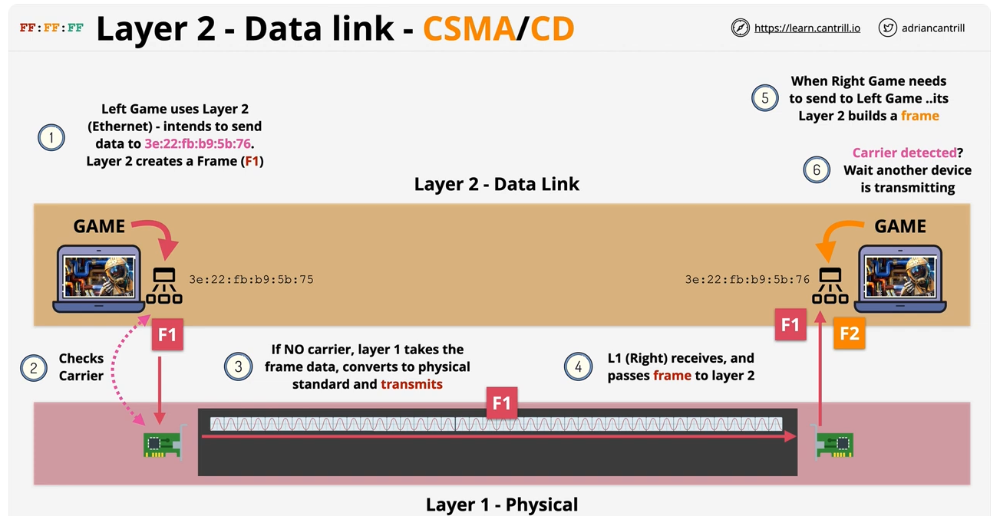

# Data Link Layer

# Table of Contents

- [Introduction](#introduction)
- [Frame](#frame)
- [Controlled access to the physical medium](#controlled-access-to-the-physical-medium)
- [Layer two using a HUB](#layer-two-using-a-hub)
- [Summary](#summary)

## Introduction

- A Data Link Layer requires a functional layer one network
- Higher layer build on lower layers adding features and compatibles
- A layer two network can run on different types of layer one networks
- There are different layer two protocols and standards for different situations
- Most local networks use Ethernet
- Layer two doesn’t focus on physical wavelengths or voltages it uses frames
- Frames are a format for sending information over a layer two network
- Layer two also introduces a unique hardware address (MAC) for every device on a network
- Its Hexadecimal, 48 bits long for e.g `3e:22:fb:b9:5b:75`
    - its not software assigned but rather attached to a specific piece of hardware
    - The MAC address on a network card should be globally unique
- A layer two (ethernet frame) can be transmitted on the shared physical medium on layer one (the copper cable), converted into voltages, RF or light. Sent across the medium and then received by other devices also connected to the shared medium
- Layer two provides frames and layer one handles the physical transmission and reception onto and from the physical shared medium.
- Layer one doesn’t understand the frame, it just transmit the raw data

---

## Frame

- **PREAMBLE**
  - Allows devices to know it's the start of the frame, so the various parts of the frame can be identified.

- ***MAC HEADER***
  - **Destination MAC Address**
    - All devices on a Layer 2 network have these addresses.
    - A frame can be sent to a specific device by putting its MAC address in the destination field.
    - Alternatively, the frame can be sent to all devices on the network, known as a broadcast.

  - **Source MAC Address**
    - The device address of whatever is submitting the frame.
    - This allows the device to receive replies.

  - **ET (Ether Type)**
    - Specifies which Layer 3 protocol is putting its data inside the frame.
    - When receiving a frame on the other side of the communication, it is important to know which Layer 3 protocol originally put data in the frame.
    - Example: IP (Internet Protocol).

- **PAYLOAD**
  - Size ranges from 46 to 1500 bytes.
  - Contains the data that the frame is sending.
  - Data is provided by the Layer 3 protocol.
  - This process is called Encapsulation:
    - Layer 3 generates data that is *encapsulated* in a Layer 2 frame.
    - The frame delivers that data to a different Layer 2 destination.
    - On the other side, the frame is analyzed, and the Layer 3 packet is extracted and given back to Layer 3 at the destination side.
    - The ET field is used to determine which Layer 3 protocol receives the data at the destination.

- **Frame Check Sequence (FCS)**
  - Used to identify any errors in the frame.
  - Simple CRC check to see if corruption has occurred.

</img>

*Layer two frames are generated by the layer two software at the source side, passed to layer one. That raw data is transmitted across the physical medium. Its taken off the physical medium at the destination side. Its passed to its layer two software and that can interpret the frame and pass that onto layer three which can then interpret that data.*

---

## Controlled access to the physical medium

- Layer two can communicate with the the layer one part of the networking stack and look for signs of a carrier signal.
- If any other devise on the network is transmitting a carrier signal it would be visible on the layer one network.
- This is the job CSMA. Carrier Sense Multiple Access
- Layer two uses layer one to transmit and receive raw data, but also adding MAC address to facilitate machine to machine communication
- If a carrier signal is not detected on the layer one network, then the frame is transmitted across the layer one network.
- One the other side the layer one network passes the raw bit stream and passes it up to its layer two.
- Layer two reviews the destination MAC address of the frame, recognises, its destined for itself and so that data can be passed on.
- However, if at the same time the left machine was transmitting the right machine attempted to do the same.
- If the left machine is transmitting then the carrier signal is detected and layer two on the right simply waits until the carrier signal is no longer detected. Its layer two which is adding this control
- Layer one on its own would transmit and cause a collision.

</img>

- However, there is also the scenario that both ends check if their is a signal at the same time and if their isn’t both transmits the data simultaneously. This causes a collision
- Layer two also contains Collision Detection (CD)
- If a collision is detected then a jam signal is sent by all the devises which detect it and a random back off occurs
- The back off is a period of time no devise will attempt to transmits, once the back off period is over the transmission is retried. If the collision occurs again then the back off is attempted again with a greater period of time
- This allows multiple devises to co-exist on the same layer two network

--- 

## Layer two using a HUB

</img>

- Here we have 4 devises connected to the same 4 port HUB
- A HUB is a layer one devise and just send data across. It sends to the data from one port to all other ports
- If the top laptop sends a frame destined for the bottom laptop the HUB sees this as raw data and broadcasts it to all the other ports.
- All the other devises receive this data, their layer two software will interpret as a frame. They will see that they’re not the destination MAC address and disregard it.

</img>

- However, the destined laptop will receive it and accept it, passing on the data further
- Also if two laptop transmit at once the HUB has no CD and it would cause a collision.

- This can be prevented by using a switch which is a layer two devise

</img>

- A switch works similarly to a HUB but it understands layer two, providing significant advantages
- A switch contains software than can understand layer two and so contains a MAC address table
- Over time it learns which devise is connected to which port. When it sees a frame it can interpret them and see the source and destination MAC address.
- Over time the MAC address table will be populated

</img>

- If the top laptop sends a frame intended for the left laptop
- The switch will see the frame arrive at the port of the top laptop
    - If the switch doesn’t know which port the destination MAC address is on it forwards it to all the other ports
    - if it does know, then it uses that one port to forward the frame to
- Switch interpret the frame and make decisions based on the source and destination MAC address of those frames.
- This has further benefits, it won’t forward collisions.
- Each port on the switch is a separate collision domain, the only things that can transmit at once is the devise and the port its connected to. Limiting collisions to one port only.
- The switch will not forward corrupted data to any of the other ports, because, it only forwards valid frames
- it receives a frame, if its valid it stores it, views it and it forwards it.
- Layer two is the foundation for all networks we use day to day

---

### Summary 
</img>