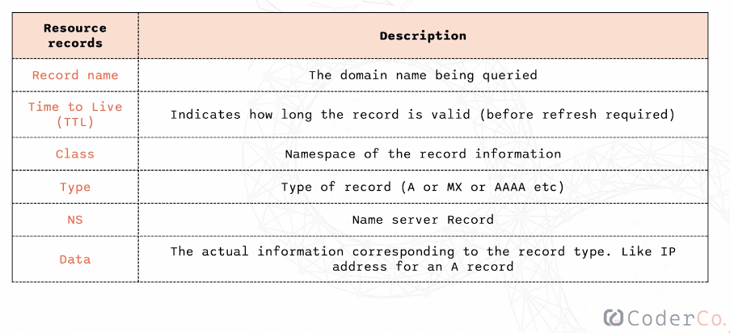
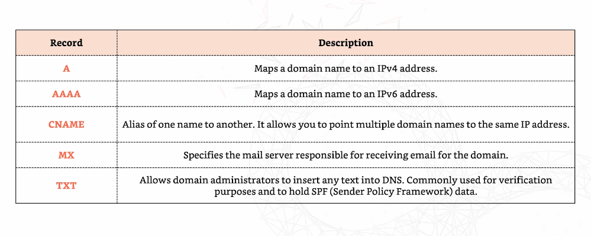
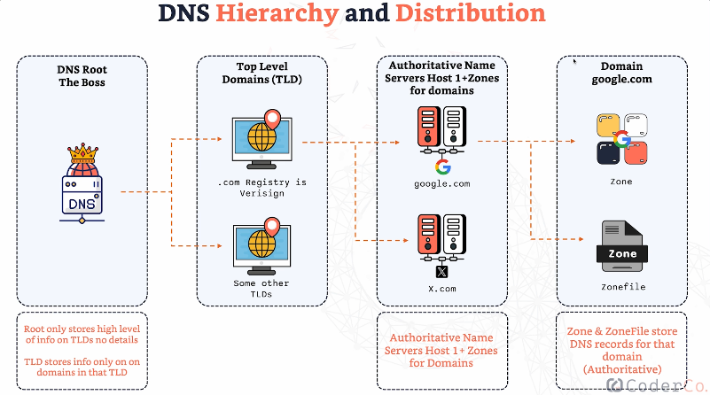
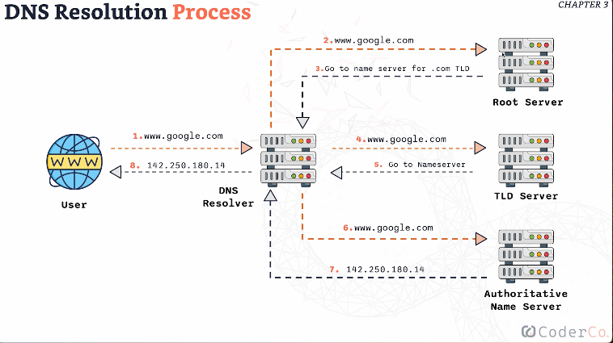

# ***Domain Name Server***

## Table of Contents

- 🧱 [Components](#components)
- 🕵🏽‍♂️ [How does DNS work](#how-does-dns-work)
-  🗺️  [DNS Heirarchy and Distribution](#dns-heirarchy-and-distribution)
- 📇 [Domain Registrar vs DNS Hosting Provider](#domain-registrar-vs-dns-hosting-provider)
- 📂 [Hosts file](#hosts-file)

### Components 
- **Name Servers**: These servers handle DNS settings and configurations, and respond to queries from clients or other servers about domain names. There are two main types:
  - **Authoritative Name Servers**: Hold the actual DNS records. When queried, they provide definitive answers, such as the IP address associated with a domain name.
  - **Recursive Name Servers**: Query other name servers on behalf of the client to retrieve DNS records. They can also cache the information to speed up future queries.

- **Zone Files**: Contain information about a domain and help name servers respond to queries when they don't have the answer directly.
  - They are organized in a readable and manageable format.
  - Zone files consist of multiple **resource records**, which store specific DNS data.

- **Resource Records**: 
  - Each record contains specific information about hosts, name servers, and various other resources within the domain.
  - **Components of Resource Records**: 
    - Record Name
    - Time-to-Live (TTL)
    - Class
    - Type (e.g., A, AAAA, CNAME)
    - Name Server (NS)
    - Data

  - **Record Structure**:
    

      
    

  - **Record Types**:
    

      
    

## How does DNS work

### DNS Resolution

- The process of converting domain names into IP addresses.

### DNS Hierarchy and Distribution

This hierarchy ensures that when you type a web address in the browser, it can quickly find the IP address to connect to, regardless of where the query is coming from.

- **DNS Root**:
  - Contains high-level information on where to find Top Level Domains (TLDs).
  
- **Top Level Domains (TLD)**:
  - Includes extensions such as `.com`, `.org`, or country codes like `.co.uk`.
  - Each TLD stores information about the domains within its scope.

- **Authoritative Name Server**:
  - Hosts zones for domains and holds the detailed DNS records for those domains.

- **Domains**:
  - Each domain has a zone and a corresponding zone file.

  

## What happends after writing URL into Browser 

  

## Domain Registrar vs DNS Hosting Provider

- **Domain Registrar**:
  - Allows users to purchase and register domain names.
  - Has relationships with the TLD registries responsible for managing various top-level domains (TLDs) like `.com`, `.net`, or `.org`.
  - The registrar communicates with the registry to manage domain registrations, renewals, and transfers.
  - Examples include GoDaddy, Cloudflare, and others.

- **DNS Hosting Provider**:
  - Operates DNS name servers that host DNS zones for domains.
  - Enables users to manage DNS records (like A, CNAME, and MX records) within these zones.
  - After purchasing a domain, you need a DNS hosting provider to host the DNS zone, ensuring that your domain can be resolved to an IP address.

## Hosts File

The `/etc/hosts` file is a local file on your computer that:

- Maps domain names to specific IP addresses.
- Takes precedence over DNS for entries listed in the file.
- Allows you to override DNS for certain domains by providing an alternative IP address.

