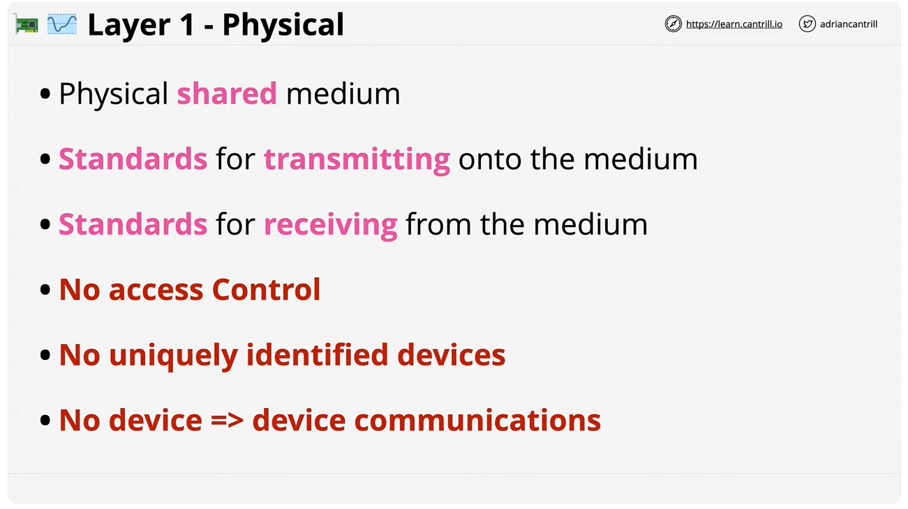

# Physical Layer

Imagine a scenario where you have two laptops and you want to play a LAN game between them. You connect them using a physical network cable.

A copper network cable acts as a point-to-point electrical shared medium between the two devices—a piece of cable used to transmit electrical signals between the two network interface cards.

- **Physical medium can be:**
  - Copper (electrical)
  - Fiber (light)
  - Wi-Fi (radio frequencies)

- **Needs to be able to carry unstructured information, so we define physical layer standards:**
  - These standards define how to transmit and receive raw bit streams between devices and a shared physical medium.
  - They specify things like voltage levels, timing, data rates, distances that can be used, modulation, and connector types on each end of the physical cable.
  - This ensures that both laptops have a shared understanding of the physical medium, allowing them to use it to send and receive raw data.

- **For the copper cable, electrical signals are used:**
  - A certain voltage is defined by binary 1 and another voltage by binary 0.
  - If both network cards in the laptops use the same standard, then 0’s and 1’s can be transmitted on the medium.
  - This is how two network interface cards can communicate on Layer 1.

</img>

- Two devices can use a point to point layer one link ( a network cable)
- To add more devises you add a hub
- So instead of being connected directly, they’re connected to the hub
- The example below uses a 4 Port Hub
- Anything the hub receives on any port is transmitted on every other port. Even errors

</img>

- The concept is that a hub creates a 4 connector network cable. One single piece of physical medium which 4 devises can be connected to 

## Layer one networking 
- There are no individual addressing all data is processed by all devices
- So one laptop can not address another directly, its a broadcast medium. This is a limitation fixed by layer 2
- Two devises might try to transmit at once, this will result in a collision, corrupting any transmissions one the shared medium
- Only one thing can transmit at once on a shared medium
- Level one also has no media access control and no collision detection
    - So no way of controlling which devices can transmit
    - Also no way of knowing when collisions occur
    - So it doesn’t scale, the more devices on this layer one physical network the more collisions
    - It only defines the standard and thats it
    - its basic
- Fundamental to networking, it’s how devises communicate at a physical level
- to be useful then we need layer 2

## Summary 

</img>