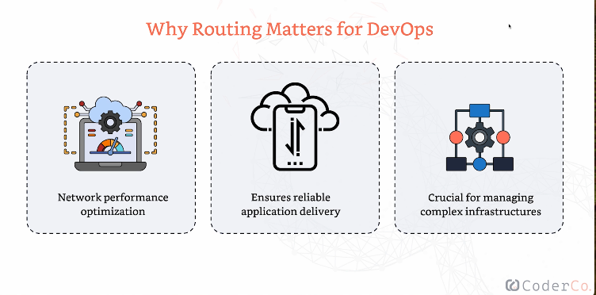

# ***Routing***

## Table of Contents

- 🧱 [Routing](#routing)
- 🧭 [Static vs Dynamic Routing](#static-vs-dynamic-routing)

## Routing

- Routing is the process of determining the best path for data to travel across networks, much like a GPS for your data.
- It ensures that data packets are sent without issues, reaching their destination quickly and efficiently.
- Without routing, data could get lost or take a long time to arrive at its destination.
- Routing is fundamental to the functioning of the internet.
- Routers use **routing tables** to make decisions about the most efficient path for data.

### Why Routing Matters in DevOps

- Effective routing ensures that data packets take the most efficient path, reducing latency and improving network performance.
- It is crucial for the reliable delivery of data, especially in complex cloud environments.
- Understanding routing is key for debugging and troubleshooting network issues.

 

      

## Static vs Dynamic Routing

| **Aspect**                | **Static Routing**                                                                 | **Dynamic Routing**                                                                  |
|---------------------------|------------------------------------------------------------------------------------|-------------------------------------------------------------------------------------|
| **Setup**                 | Manually configured by network administrators.                                      | Automatically adjusts using algorithms.                                             |
| **Flexibility**           | Fixed routes that do not adapt to changes unless manually updated.                  | Adjusts routes based on real-time network conditions.                               |
| **Reliability**           | Reliable for small, stable networks.                                                | Adapts to changes like new devices or failed connections without manual intervention.|
| **Scalability**           | Simple but not scalable; suited for small networks.                                 | Highly scalable, suitable for large, complex networks.                              |
| **Maintenance**           | Requires manual updates when network changes occur.                                 | Automatically recalculates routes as network topology changes.                      |
| **Protocols**             | Not applicable (manually set).                                                      | Uses routing protocols like OSPF (Open Shortest Path First) and BGP (Border Gateway Protocol). |
| **Use Case**              | Best for small, stable networks where routes rarely change.                         | Ideal for large, dynamic networks with frequent changes.                            |

