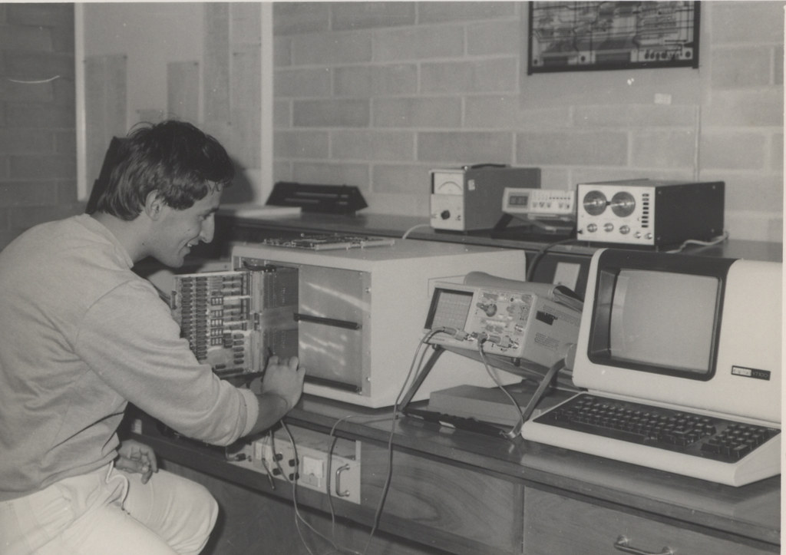

## Terminal 

The terminal is a command-line interface (CLI) that allows you to interact with the operating system by typing commands. It's an incredibly powerful tool that enables you to execute commands, run scripts, and navigate your file system with precision. By providing direct control over your system, the terminal is an essential skill for developers to master, offering unparalleled flexibility and efficiency in managing tasks, automating processes, and troubleshooting issues.

### Examples of Terminals:
- GNOME Terminal
- xterm
- macOS Terminal
- Windows Terminal

### A Brief History of the Terminal:
The concept of the terminal dates back to the early days of computing, when computers were large mainframes accessed by multiple users via **teletype machines (TTY)**. These devices were essentially typewriters connected to a computer, allowing users to input commands and receive printed output.

In the 1970s, **video display terminals (VDTs)** emerged, which allowed text to be displayed on a screen rather than printed on paper. This development was a significant leap forward, leading to the creation of the **Unix shell**, a command-line interpreter that provided a powerful environment for interacting with the Unix operating system.

Over time, the terminal evolved from physical devices to software applications in modern operating systems, but the core concept remained the same. Today, the terminal is an integral part of many operating systems, especially in Unix-like environments such as Linux and macOS, where it continues to be a vital tool for system administration, development, and more.

