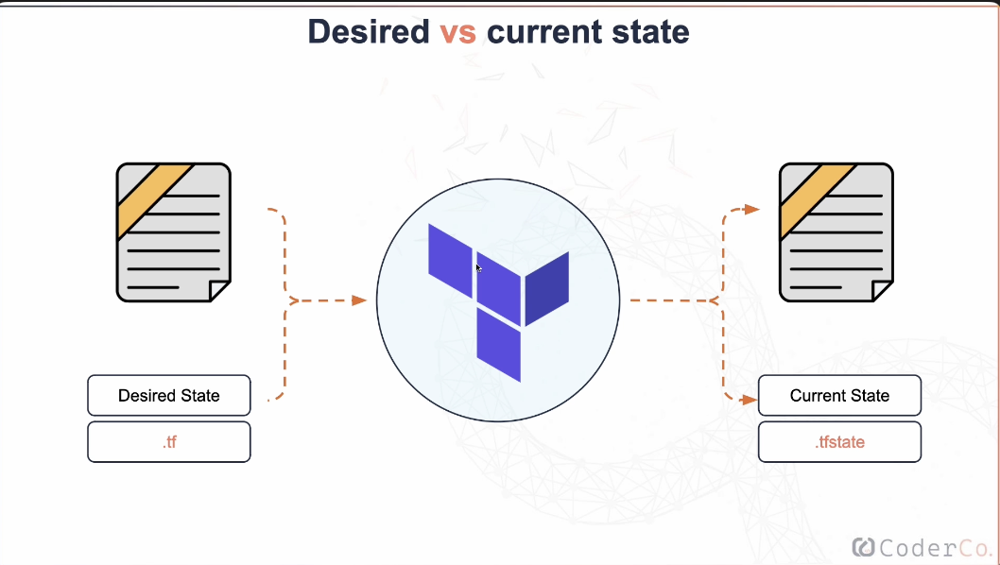

# Terraform

## What is Infrastructure as Code (IaC)?  
Infrastructure as Code (IaC) is a process that automates the provisioning and management of infrastructure using code, replacing manual configurations and settings.  

---

## Key Features of IaC  
1. **Code-Based Infrastructure Management**  
   - Infrastructure is defined and managed using code, making the process consistent and repeatable.  

2. **Version Control**  
   - IaC code can be stored in version control systems (e.g., Git) to:  
     - Track changes made to the infrastructure setup.  
     - Roll back to specific versions if needed.  
     - Facilitate collaboration among team members.  
     - Allow team members to push updates to the same infrastructure, often managed through files like the Terraform state file and Terraform lock file.  

---

## Benefits of IaC  
- **Ease of Adjustments**: Modifying infrastructure configurations becomes straightforward and efficient.  
- **Replicability**: Enables consistent setups across environments (e.g., development, staging, production).  
- **Scalability**: Simplifies scaling infrastructure to meet growing demands.  
- **Error Reduction**: Reduces the risk of manual errors and avoids the tedious nature of manual processes.  

---

By leveraging IaC, teams can streamline infrastructure management, improve collaboration, and ensure reliable deployments.  

## Infrastructure Orchestration vs Configuration Management

| Aspect                       | Infrastructure Orchestration                                 | Configuration Management                              |
|------------------------------|-------------------------------------------------------------|-----------------------------------------------------|
| **Definition**               | Automates the provisioning, management, and scaling of infrastructure resources. | Maintains systems in a desired state by automating software and system configurations. |
| **Common Tools**             | - Terraform - AWS CloudFormation                        | - Ansible - Puppet - Chef                     |
| **Purpose**                  | Deploys and manages infrastructure components like servers, storage, and networks. | Configures software, applications, and services on provisioned infrastructure. |
| **Example Use Case**         | Use Terraform to deploy EC2 instances on AWS.              | Use Ansible to configure EC2 instances to run specific applications or services. |
| **Workflow**                 | 1. Provision infrastructure like EC2 instances, networking, or storage. 2. Ensure consistent resource creation. | 1. Set up necessary services (e.g., web servers). 2. Apply security configurations and install required software. |
| **Separation of Concerns**   | Focuses on creating the resources.                         | Focuses on configuring and maintaining the resources. |

## Combined Workflow Example

| Step                          | Description                                                                                     |
|-------------------------------|-------------------------------------------------------------------------------------------------|
| **1. Deploy Infrastructure** | Use an orchestration tool like Terraform to provision the underlying infrastructure (e.g., EC2).|
| **2. Configure Services**     | Use a configuration management tool like Ansible to set up services and apply configurations.  |
| **Benefits**                  | - Separation of concerns ensures clarity and scalability. - Automation increases repeatability across environments. |

---

## What is Terraform?  
Terraform is a powerful Infrastructure as Code (IaC) tool that allows engineers to automate the provisioning and management of infrastructure across various cloud providers.  

---

## Key Features of Terraform  
- **IaC Tool**: Enables infrastructure management through code, ensuring consistency and repeatability.  
- **Cloud-Agnostic**: Supports deployment to multiple cloud providers (e.g., AWS, Azure, Google Cloud) and even on-premise solutions.  

---

## How Terraform Works  
1. **Plan Phase**:  
   - Engineers run a `plan`, which compares the current state of the infrastructure (as defined by the Terraform state file) with the proposed changes in the code.  
   - The plan details:  
     - **Services to Create**: Lists new resources to be added.  
     - **Services to Destroy**: Highlights resources that will be removed.  
     - **Services to Modify**: Identifies changes to existing resources.  
   - This provides engineers with a clear preview, ensuring they are confident in the changes before applying them.  

2. **Apply Phase**:  
   - Once satisfied with the plan, engineers run `apply`, which executes the proposed changes to bring the actual infrastructure in line with the code.  

[Terraform Documentation](https://developer.hashicorp.com/terraform?product_intent=terraform)

---

## Terraform State File  

The Terraform state file (`.tfstate`) is a critical component in Terraform's workflow. It serves as an up-to-date record of the current infrastructure state and ensures consistency during deployments.  

---

### Key Features of the Terraform State File  
1. **Blueprint of Infrastructure**  
   - Acts as a real-time representation of the current state of your infrastructure, similar to how the master branch in GitHub represents the source of truth for code.  

2. **Ensures Idempotency**  
   - **Definition**: Idempotency means that no matter how many times you run the same configuration, the result will remain consistent.  
   - Prevents multiple deployments of unchanged resources, keeping the infrastructure stable.  
   - Ensures that adding a small change in the `.tf` configuration file results only in that specific change being implemented, without affecting unrelated resources.  

3. **Desired vs Current State**  
   - **Current State**:  
     - Maintained in the `.tfstate` file.  
     - Represents what currently exists in your infrastructure.  
   - **Desired State**:  
     - Defined in the `.tf` configuration files.  
     - Represents the changes or new infrastructure you are trying to deploy.  

     </img>  

4. **State Comparison**  
   - Terraform compares the **current state** (from the `.tfstate` file) with the **desired state** (from the `.tf` files).  
   - Based on the comparison, Terraform determines the necessary changes and applies them to bring the current state in line with the desired state.  

---

 
# Common Terraform Commands  

| **Command**             | **Purpose**                                                                                   | **Example**                         |
|-------------------------|-----------------------------------------------------------------------------------------------|-------------------------------------|
| `terraform init`        | Initializes a Terraform working directory. Downloads required providers and sets up the environment. | `terraform init`                   |
| `terraform plan`        | Generates and displays an execution plan by comparing the current state to the desired state. | `terraform plan`                   |
| `terraform apply`       | Executes the changes required to match the desired state defined in the configuration files.  | `terraform apply`                  |
| `terraform destroy`     | Destroys all resources managed by the Terraform configuration.                                | `terraform destroy`                |
| `terraform fmt`         | Formats Terraform configuration files to a standardized style.                               | `terraform fmt`                    |
| `terraform validate`    | Validates the syntax and structure of the configuration files without performing any actions. | `terraform validate`               |
| `terraform show`        | Displays the current state or the details of a specific state file.                          | `terraform show`                   |
| `terraform output`      | Extracts and displays the output values defined in the configuration.                        | `terraform output`                 |
| `terraform refresh`     | Updates the state file with the latest information about the infrastructure.                 | `terraform refresh`                |
| `terraform state`       | Commands to inspect or manipulate the Terraform state.                                       | `terraform state list`             |
| `terraform import`      | Imports existing infrastructure into Terraform's state management.                           | `terraform import aws_instance.my_instance i-12345678` |
| `terraform taint`       | Marks a resource for recreation during the next `apply`.                                     | `terraform taint aws_instance.my_instance` |
| `terraform untaint`     | Removes the "tainted" mark from a resource.                                                  | `terraform untaint aws_instance.my_instance` |
| `terraform graph`       | Generates a visual graph of the Terraform configuration.                                     | `terraform graph | dot -Tpng > graph.png` |

